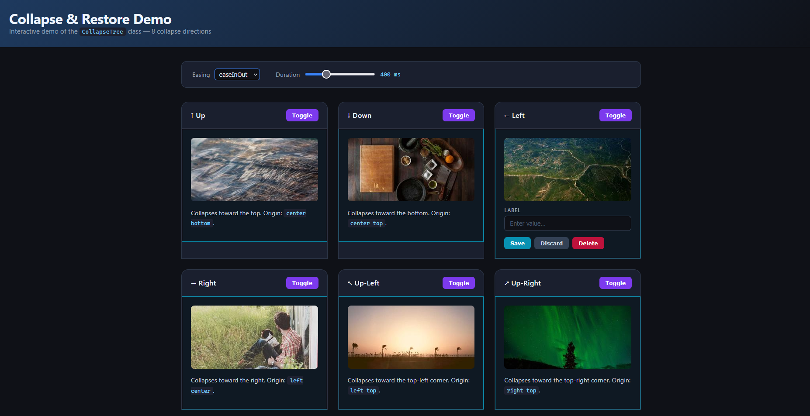

# CollapseTree

A lightweight, zero-dependency JavaScript class for collapsing and restoring DOM panels in any of 8 directions with smooth CSS transitions.



## Setup

```html
<script src="js/CollapseTree.js"></script>
```

`CollapseTree.autoInit()` runs automatically on `DOMContentLoaded`. No further setup is needed for the declarative API.

---

## API

### Imperative API

Instantiate directly and call methods on the returned object.

```js
const panel = new CollapseTree(element, initialState?)
```

| Parameter | Type | Default | Description |
|---|---|---|---|
| `element` | `HTMLElement` | required | The panel element to control |
| `initialState` | `string` | `null` | Direction to start in a collapsed state (e.g. `'up'`) |

#### Methods

```js
panel.collapse(direction, duration?, easing?)
```
Collapses the panel. No-op if already collapsed.

```js
panel.restore(duration?, easing?)
```
Restores the panel to its original state. No-op if already open.

```js
panel.toggle(direction, duration?, easing?)
```
Collapses if open, restores if collapsed.

```js
panel.transition(direction, duration?, easing?)
```
The underlying unified method. Detects current state and performs the correct operation. `collapse`, `restore`, and `toggle` all delegate here.

#### Getter

```js
panel.isCollapsed  // boolean
```

#### Method parameters

| Parameter | Type | Default | Description |
|---|---|---|---|
| `direction` | `string` | `'up'` | Collapse direction — see [Directions](#directions) |
| `duration` | `number` | `300` | Animation duration in milliseconds |
| `easing` | `string` | `'easeInOut'` | Easing name — see [Easings](#easings) |

#### Example

```js
const panel = new CollapseTree(document.getElementById('my-panel'));

panel.collapse('right', 500, 'bounce');
panel.restore(500, 'bounce');
panel.toggle('up', 400);

// Start already collapsed
const pre = new CollapseTree(document.getElementById('sidebar'), 'left');
```

---

### Declarative API

Add a class or `data-collapse` attribute directly to a panel element. `autoInit` parses it and wires everything up automatically.

#### Class

```
class="collapse-{direction}-{easing}-{duration}[-{state}]"
```

- `state` is optional and defaults to `open`
- Compound directions (`up-left`, `down-right`, etc.) are recognised automatically

```html
<div id="panel" class="collapse-up-easeInOut-500-open">…</div>
<div id="panel" class="collapse-up-left-bounce-300-closed">…</div>
<div id="panel" class="collapse-right-linear-600">…</div>
```

#### Attribute

```
data-collapse="{direction} {easing} {duration} [{state}]"
```

Space-separated. Takes priority over the class if both are present.

```html
<div id="panel" data-collapse="up easeInOut 500 open">…</div>
<div id="panel" data-collapse="up-left bounce 300 closed">…</div>
```

#### Trigger buttons

Any element with `data-collapse-trigger` pointing to a panel `id` is wired to toggle that panel using its own config. Set `data-open` to drive CSS open/closed styling.

```html
<button data-collapse-trigger="panel" data-open="true">Toggle</button>
```

The `data-open` attribute is toggled between `"true"` and `"false"` on each click.

#### Accessing the instance

`autoInit` stores the instance on the element itself:

```js
const instance = document.getElementById('panel')._collapseTree;
instance.toggle('down', 200);
```

#### Manual init

`autoInit` can be called manually — for example after dynamically inserting panels into the DOM:

```js
CollapseTree.autoInit(containerElement);
```

Passing a subtree root scopes the scan to that element. Returns a `Map` of all registered instances.

---

### Directions

| Value | Collapses toward |
|---|---|
| `up` | top edge |
| `down` | bottom edge |
| `left` | left edge |
| `right` | right edge |
| `up-left` | top-left corner |
| `up-right` | top-right corner |
| `down-left` | bottom-left corner |
| `down-right` | bottom-right corner |

### Easings

| Value | Curve |
|---|---|
| `linear` | `linear` |
| `ease` | `ease` |
| `easeIn` | `cubic-bezier(0.42, 0, 1, 1)` |
| `easeOut` | `cubic-bezier(0, 0, 0.58, 1)` |
| `easeInOut` | `cubic-bezier(0.42, 0, 0.58, 1)` |
| `bounce` | `cubic-bezier(0.68, -0.55, 0.265, 1.55)` |

---

## State tracking

The collapsed direction is stored on the element as `data-collapsed`. Use it for CSS hooks:

```css
#panel[data-collapsed] { pointer-events: none; }
#panel[data-collapsed="right"] { border-right: none; }
```
